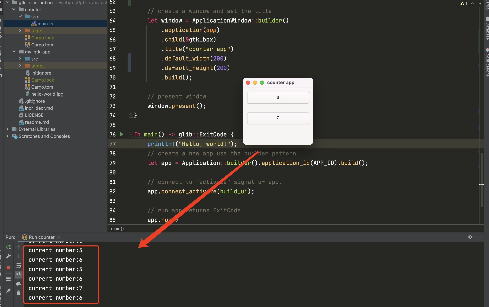

# counter实现
```rust
use std::rc::Rc;
use gtk::prelude::*;
use gtk::{glib, Application, ApplicationWindow, Button};
use std::cell::Cell;
use gtk::Orientation;
use glib::clone;

const APP_ID: &str = "org.my.HelloWorld";

fn create_btn(s : &str) -> Button {
    let btn = Button::builder()
        .label(s)
        .margin_top(12)
        .margin_bottom(12)
        .margin_start(12)
        .margin_end(12)
        .build();
    btn
}

fn build_ui(app: &Application) {
    // rc引用计数+cell内部可变性实现计数器
    // interior mutability 内在可变性，本身不能修改，但是内部的T可以修改
    let number = Rc::new(Cell::new(0));
    let button_increase = create_btn("incr");
    let button_decrease = create_btn("decr");

    // Connect callbacks
    // 弱引用
    button_increase.connect_clicked(clone!(@weak number, @strong button_decrease =>
        move |_| {
            number.set(number.get() + 1);
            let v = number.get();
            println!("current number:{}",v);
            button_decrease.set_label(&v.to_string());
    }));
    button_decrease.connect_clicked(clone!(@weak button_increase =>
        move |_| {
            number.set(number.get() - 1);
            let v = number.get();
            println!("current number:{}",v);
            button_increase.set_label(&v.to_string());
    }));

    // add buttons to gtk_box
    let gtk_box = gtk::Box::builder()
        .orientation(Orientation::Vertical)
        .build();
    gtk_box.append(&button_increase);
    gtk_box.append(&button_decrease);

    // create a window and set the title
    let window = ApplicationWindow::builder()
        .application(app)
        .child(&gtk_box)
        .title("counter app")
        .default_width(200)
        .default_height(200)
        .build();

    // present window
    window.present();
}

fn main() -> glib::ExitCode {
    println!("Hello, world!");
    // create a new app use the builder pattern
    let app = Application::builder().application_id(APP_ID).build();

    // connect to "activate" signal of app.
    app.connect_activate(build_ui);

    // run app returns ExitCode
    app.run()
}

```
# 运行效果

