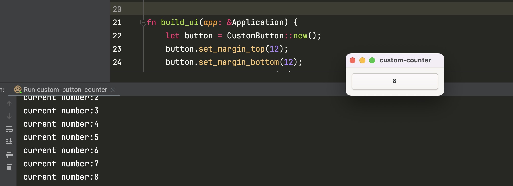

# custom-button-counter
在custom-button基础之上实现counter累加

# custom-button实现
https://gtk-rs.org/gtk4-rs/stable/latest/book/g_object_subclassing.html

实现核心代码：
```rust
use glib::Object;
use gtk::glib;
use gtk::prelude::*;
use gtk::subclass::prelude::*;
use std::cell::Cell;

// 通过 glib::wrapper 包裹 CustomButton 声明
glib::wrapper! {
    pub struct CustomButton(ObjectSubclass<CustomButtonCounter>)
        @extends gtk::Button, gtk::Widget,
        @implements gtk::Accessible, gtk::Actionable, gtk::Buildable, gtk::ConstraintTarget;
}

// CustomButton 实现 ObjectSubclass
impl CustomButton {
    pub fn new() -> Self {
        Object::builder().build()
    }

    pub fn with_label(label: &str) -> Self {
        Object::builder().property("label", label).build()
    }
}

#[derive(Default)]
pub struct CustomButtonCounter {
    number: Cell<i32>, // number内部可变
}

#[glib::object_subclass]
impl ObjectSubclass for CustomButtonCounter {
    const NAME: &'static str = "CustomButtonCounter";
    type Type = CustomButton;
    // 之后将被创建的实际GObject
    type ParentType = gtk::Button;
}

// Trait shared by all GObjects
impl ObjectImpl for CustomButtonCounter {
    fn constructed(&self) {
        self.parent_constructed(); // 调用父类的构造函数
        // 设置初始化值为0
        self.obj().set_label(&self.number.get().to_string());
    }
}

// Trait shared by all widgets
impl WidgetImpl for CustomButtonCounter {}

// Trait shared by all buttons
impl ButtonImpl for CustomButtonCounter {
    fn clicked(&self) {
        // 点击逻辑 number+1
        let number = self.number.get() + 1; // 获取点击之前的值并加1
        self.number.set(number);

        println!("current number:{}",number);

        // 将累加的number写入到label上
        self.obj().set_label(&self.number.get().to_string());
    }
}

```

# 运行效果

