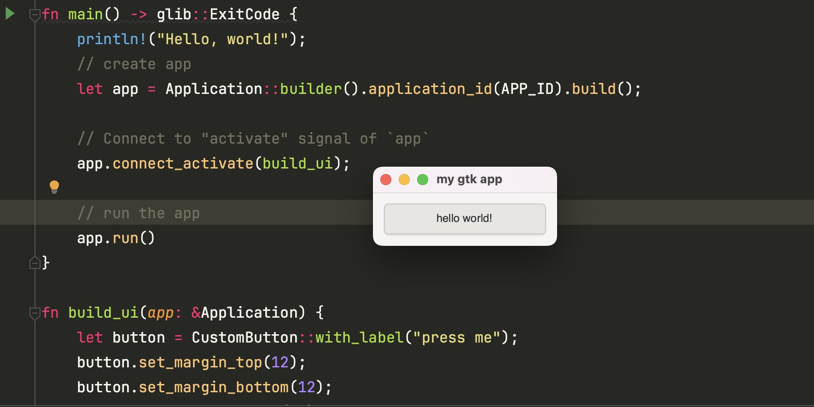

# 子类#
GObject非常依赖继承。我们可以通过继承Button实现自定义按钮。

# 实现思路
1. 实现ObjectSubClass
    - NAME: 这个子类的名称，为了保持唯一性，使用包名+类名
    - Type: 之后将被创建的实际GObject
    - ParentType: 父类型
2. 实现 ObjectSubclass trait new方法

custom_button/imp.rs
```rust
use glib::Object;
use gtk::glib;
use gtk::subclass::prelude::*;

// 通过 glib::wrapper 包裹 CustomButton 声明
glib::wrapper! {
    pub struct CustomButton(ObjectSubclass<CustomButtonClass>)
        @extends gtk::Button, gtk::Widget,
        @implements gtk::Accessible, gtk::Actionable, gtk::Buildable, gtk::ConstraintTarget;
}

// CustomButton 实现 ObjectSubclass
impl CustomButton {
    pub fn new() -> Self {
        Object::builder().build()
    }

    pub fn with_label(label: &str) -> Self {
        Object::builder().property("label", label).build()
    }
}

impl Default for CustomButton {
    fn default() -> Self {
        Self::new()
    }
}

#[derive(Default)]
pub struct CustomButtonClass;
#[glib::object_subclass]
impl ObjectSubclass for CustomButtonClass {
    const NAME: &'static str = "appCustomButton";
    type Type = CustomButton;
    type ParentType = gtk::Button;
}

// Trait shared by all GObjects
impl ObjectImpl for CustomButtonClass {}

// Trait shared by all widgets
impl WidgetImpl for CustomButtonClass {}

// Trait shared by all buttons
impl ButtonImpl for CustomButtonClass {}
```

# 开始运行
src/main.rs 代码如下：
```rust
mod custom_button;

use custom_button::CustomButton;
use gtk::prelude::*;
use gtk::{glib, Application, ApplicationWindow};

const APP_ID: &str = "my.app.custom.button";

fn main() -> glib::ExitCode {
    println!("Hello, world!");
    // create app
    let app = Application::builder().application_id(APP_ID).build();

    // Connect to "activate" signal of `app`
    app.connect_activate(build_ui);

    // run the app
    app.run()
}

fn build_ui(app: &Application) {
    let button = CustomButton::with_label("press me");
    button.set_margin_top(12);
    button.set_margin_bottom(12);
    button.set_margin_start(12);
    button.set_margin_end(12);

    // connect to clicked signal of button
    button.connect_clicked(move |button| {
        button.set_label("hello world!");
    });

    // create a window
    let window = ApplicationWindow::builder()
        .application(app)
        // .default_height(200)
        .default_width(200)
        .title("my gtk app")
        .child(&button)
        .build();

    window.present();
}
```
效果如下：

