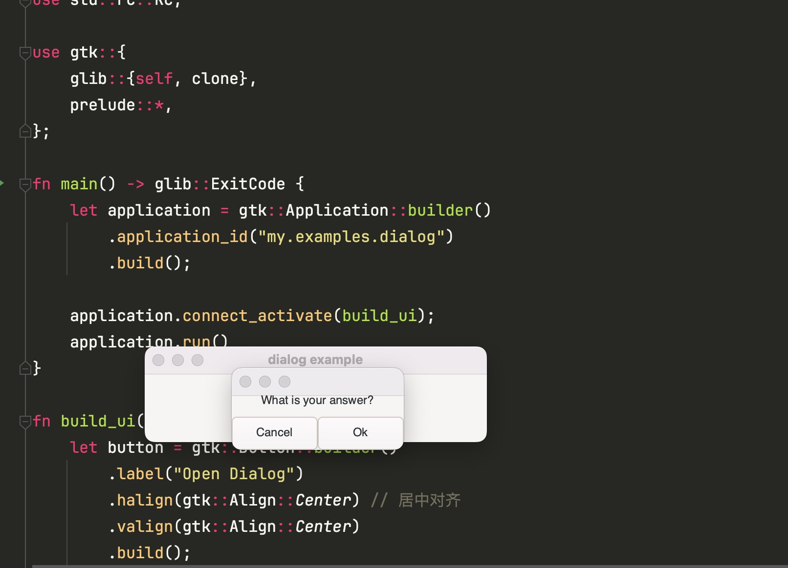

# dialog
对话框实现，主要通过引用计数rc的方式实现
```rust
// 引用计数的方式声明window
let window = Rc::new(
    gtk::ApplicationWindow::builder()
        .application(application)
        .title("dialog example")
        .default_width(350)
        .default_height(70)
        .child(&button)
        .visible(true)
        .build(),
);
```
# 运行效果

